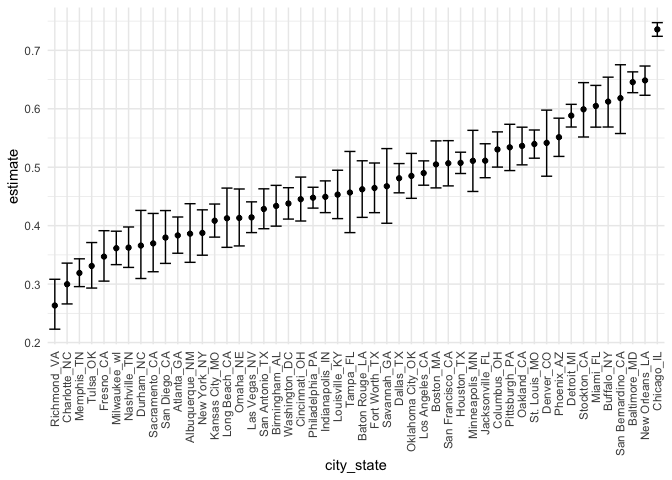
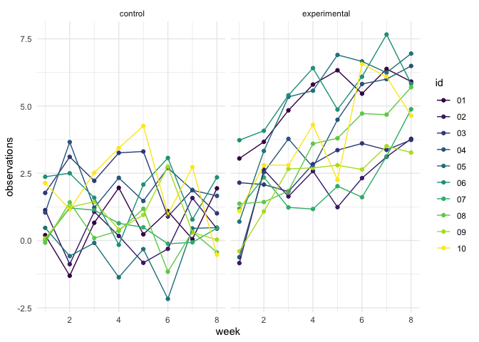
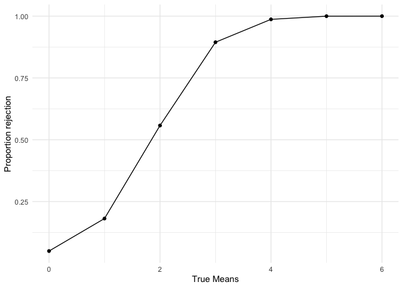
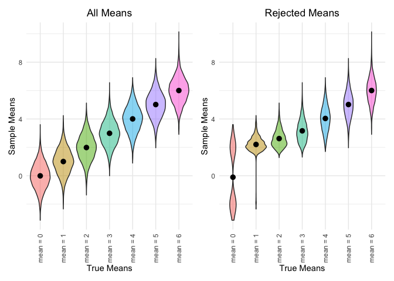

p8105\_hw5\_ll3344
================
Lusha Liang

## Problem 1: Unsolved Homicides

Load necessary
    packages.

``` r
library(tidyverse)
```

    ## ── Attaching packages ──────────────────────────────────────────────────────────────────────────────────────── tidyverse 1.3.0 ──

    ## ✓ ggplot2 3.3.2     ✓ purrr   0.3.4
    ## ✓ tibble  3.0.1     ✓ dplyr   1.0.2
    ## ✓ tidyr   1.1.0     ✓ stringr 1.4.0
    ## ✓ readr   1.3.1     ✓ forcats 0.5.0

    ## ── Conflicts ─────────────────────────────────────────────────────────────────────────────────────────── tidyverse_conflicts() ──
    ## x dplyr::filter() masks stats::filter()
    ## x dplyr::lag()    masks stats::lag()

``` r
library(viridis)
```

    ## Loading required package: viridisLite

``` r
library(plotly)
```

    ## 
    ## Attaching package: 'plotly'

    ## The following object is masked from 'package:ggplot2':
    ## 
    ##     last_plot

    ## The following object is masked from 'package:stats':
    ## 
    ##     filter

    ## The following object is masked from 'package:graphics':
    ## 
    ##     layout

``` r
library(patchwork)
```

Set ggplot theme.

``` r
# Minimalist theme
theme_set(theme_minimal())
```

Read in the data.

``` r
homicide_df = 
  read_csv("./data/homicide_data.csv")
```

    ## Parsed with column specification:
    ## cols(
    ##   uid = col_character(),
    ##   reported_date = col_double(),
    ##   victim_last = col_character(),
    ##   victim_first = col_character(),
    ##   victim_race = col_character(),
    ##   victim_age = col_character(),
    ##   victim_sex = col_character(),
    ##   city = col_character(),
    ##   state = col_character(),
    ##   lat = col_double(),
    ##   lon = col_double(),
    ##   disposition = col_character()
    ## )

Describe the raw data:

  - The homicide data set contains 52179 rows, representing homicides in
    50 cities across America and 12 columns which include information
    about the homicide.
  - The information contained about each homicide includes: uid,
    reported\_date, victim\_last, victim\_first, victim\_race,
    victim\_age, victim\_sex, city, state, lat, lon, disposition.
  - The column disposition contains three possible outcomes: Closed by
    arrest, Closed without arrest, Open/No arrest.
  - The dates included range from 2007-2017.

Next, we will create a city\_state variable that combines the city and
state in one variable. We will then combine the disposition “Closed
without arrest” and “Open/No arrest” into one disposition of “unsolved.”
The remaining “Closed by arrest” homicides will be designated as
“solved.”

``` r
homicide_df = 
  read_csv("./data/homicide_data.csv") %>%
  mutate(
    city_state = str_c(city, state, sep = "_"),
    resolved = case_when(
      disposition == "Closed without arrest" ~ "unsolved",
      disposition == "Open/No arrest"        ~ "unsolved",
      disposition == "Closed by arrest"      ~ "solved"
    )
  ) %>%
  select(city_state, resolved) %>%
  filter(city_state != "Tulsa_AL")
```

    ## Parsed with column specification:
    ## cols(
    ##   uid = col_character(),
    ##   reported_date = col_double(),
    ##   victim_last = col_character(),
    ##   victim_first = col_character(),
    ##   victim_race = col_character(),
    ##   victim_age = col_character(),
    ##   victim_sex = col_character(),
    ##   city = col_character(),
    ##   state = col_character(),
    ##   lat = col_double(),
    ##   lon = col_double(),
    ##   disposition = col_character()
    ## )

We will now group by city\_state variable and count total and unsolved
homicides.

``` r
aggregate_df = 
  homicide_df %>%
  group_by(city_state) %>%
  summarize(
    hom_total = n(),
    hom_unsolved = sum(resolved == "unsolved")
  ) 
```

    ## `summarise()` ungrouping output (override with `.groups` argument)

Now we will perform a prop test for a single city to estimate the
proportion of unsolved homicides.

``` r
prop.test(
  aggregate_df %>% filter(city_state == "Baltimore_MD") %>% pull(hom_unsolved),
  aggregate_df %>% filter(city_state == "Baltimore_MD") %>% pull(hom_total)) %>% 
  broom::tidy()
```

    ## # A tibble: 1 x 8
    ##   estimate statistic  p.value parameter conf.low conf.high method    alternative
    ##      <dbl>     <dbl>    <dbl>     <int>    <dbl>     <dbl> <chr>     <chr>      
    ## 1    0.646      239. 6.46e-54         1    0.628     0.663 1-sample… two.sided

Next, we will iterate the prop. test for multiple cities at once.

``` r
results_df = 
  aggregate_df %>%
  mutate(
    prop_tests = map2(.x = hom_unsolved, .y = hom_total, ~prop.test(x = .x, n = .y)),
    tidy_tests = map(.x = prop_tests, ~broom::tidy(.x))
  ) %>%
  select(-prop_tests) %>%
  unnest(tidy_tests) %>%
  select(city_state, estimate, conf.low, conf.high)
```

We can plot the estimates and confidence intervals for proportion of
unsolved homicides for each city.

``` r
results_df %>%
  mutate(city_state = fct_reorder(city_state, estimate)) %>%
  ggplot(aes(x = city_state, y = estimate)) +
  geom_point() + 
  geom_errorbar(aes(ymin = conf.low, ymax = conf.high)) +
  theme(axis.text.x = element_text(angle = 90, vjust = 0.5, hjust = 1)) 
```

<!-- -->

## Problem 2: Longitudinal Study Data

Load and tidy the data. This involves compiling each spreadsheet into a
list while keeping the title of the spreadsheet, since this also
contains information about the subject ID and the control vs
experimental group. Then to make the dataset tidy we pivot\_longer so
that the week number and values obtained are in contained in separate
columns.

``` r
lga_df = 
  tibble(
    path = list.files("prob_2"),
  ) %>% 
  mutate(
    path = str_c("prob_2/", path),
    data = map(path, read_csv)
    ) %>%
  unnest(data) %>%
  mutate(path = str_replace(path, "prob_2/", " "),
         path = str_replace(path, ".csv", " ")) %>%
  separate(path, into = c("group", "id"), sep = "_") %>%
  pivot_longer(
    week_1:week_8,
    names_to = "week", 
    names_prefix = "week_", 
    values_to = "observations"
  ) %>%
  mutate(
    group = str_replace(group, "con", "control"),
    group = str_replace(group, "exp", "experimental")
  ) %>%
  relocate(id) %>%
  mutate(
    group = as.factor(group),
    week = as.numeric(week)
  )
```

    ## Parsed with column specification:
    ## cols(
    ##   week_1 = col_double(),
    ##   week_2 = col_double(),
    ##   week_3 = col_double(),
    ##   week_4 = col_double(),
    ##   week_5 = col_double(),
    ##   week_6 = col_double(),
    ##   week_7 = col_double(),
    ##   week_8 = col_double()
    ## )
    ## Parsed with column specification:
    ## cols(
    ##   week_1 = col_double(),
    ##   week_2 = col_double(),
    ##   week_3 = col_double(),
    ##   week_4 = col_double(),
    ##   week_5 = col_double(),
    ##   week_6 = col_double(),
    ##   week_7 = col_double(),
    ##   week_8 = col_double()
    ## )
    ## Parsed with column specification:
    ## cols(
    ##   week_1 = col_double(),
    ##   week_2 = col_double(),
    ##   week_3 = col_double(),
    ##   week_4 = col_double(),
    ##   week_5 = col_double(),
    ##   week_6 = col_double(),
    ##   week_7 = col_double(),
    ##   week_8 = col_double()
    ## )
    ## Parsed with column specification:
    ## cols(
    ##   week_1 = col_double(),
    ##   week_2 = col_double(),
    ##   week_3 = col_double(),
    ##   week_4 = col_double(),
    ##   week_5 = col_double(),
    ##   week_6 = col_double(),
    ##   week_7 = col_double(),
    ##   week_8 = col_double()
    ## )
    ## Parsed with column specification:
    ## cols(
    ##   week_1 = col_double(),
    ##   week_2 = col_double(),
    ##   week_3 = col_double(),
    ##   week_4 = col_double(),
    ##   week_5 = col_double(),
    ##   week_6 = col_double(),
    ##   week_7 = col_double(),
    ##   week_8 = col_double()
    ## )
    ## Parsed with column specification:
    ## cols(
    ##   week_1 = col_double(),
    ##   week_2 = col_double(),
    ##   week_3 = col_double(),
    ##   week_4 = col_double(),
    ##   week_5 = col_double(),
    ##   week_6 = col_double(),
    ##   week_7 = col_double(),
    ##   week_8 = col_double()
    ## )
    ## Parsed with column specification:
    ## cols(
    ##   week_1 = col_double(),
    ##   week_2 = col_double(),
    ##   week_3 = col_double(),
    ##   week_4 = col_double(),
    ##   week_5 = col_double(),
    ##   week_6 = col_double(),
    ##   week_7 = col_double(),
    ##   week_8 = col_double()
    ## )
    ## Parsed with column specification:
    ## cols(
    ##   week_1 = col_double(),
    ##   week_2 = col_double(),
    ##   week_3 = col_double(),
    ##   week_4 = col_double(),
    ##   week_5 = col_double(),
    ##   week_6 = col_double(),
    ##   week_7 = col_double(),
    ##   week_8 = col_double()
    ## )
    ## Parsed with column specification:
    ## cols(
    ##   week_1 = col_double(),
    ##   week_2 = col_double(),
    ##   week_3 = col_double(),
    ##   week_4 = col_double(),
    ##   week_5 = col_double(),
    ##   week_6 = col_double(),
    ##   week_7 = col_double(),
    ##   week_8 = col_double()
    ## )
    ## Parsed with column specification:
    ## cols(
    ##   week_1 = col_double(),
    ##   week_2 = col_double(),
    ##   week_3 = col_double(),
    ##   week_4 = col_double(),
    ##   week_5 = col_double(),
    ##   week_6 = col_double(),
    ##   week_7 = col_double(),
    ##   week_8 = col_double()
    ## )
    ## Parsed with column specification:
    ## cols(
    ##   week_1 = col_double(),
    ##   week_2 = col_double(),
    ##   week_3 = col_double(),
    ##   week_4 = col_double(),
    ##   week_5 = col_double(),
    ##   week_6 = col_double(),
    ##   week_7 = col_double(),
    ##   week_8 = col_double()
    ## )
    ## Parsed with column specification:
    ## cols(
    ##   week_1 = col_double(),
    ##   week_2 = col_double(),
    ##   week_3 = col_double(),
    ##   week_4 = col_double(),
    ##   week_5 = col_double(),
    ##   week_6 = col_double(),
    ##   week_7 = col_double(),
    ##   week_8 = col_double()
    ## )
    ## Parsed with column specification:
    ## cols(
    ##   week_1 = col_double(),
    ##   week_2 = col_double(),
    ##   week_3 = col_double(),
    ##   week_4 = col_double(),
    ##   week_5 = col_double(),
    ##   week_6 = col_double(),
    ##   week_7 = col_double(),
    ##   week_8 = col_double()
    ## )
    ## Parsed with column specification:
    ## cols(
    ##   week_1 = col_double(),
    ##   week_2 = col_double(),
    ##   week_3 = col_double(),
    ##   week_4 = col_double(),
    ##   week_5 = col_double(),
    ##   week_6 = col_double(),
    ##   week_7 = col_double(),
    ##   week_8 = col_double()
    ## )
    ## Parsed with column specification:
    ## cols(
    ##   week_1 = col_double(),
    ##   week_2 = col_double(),
    ##   week_3 = col_double(),
    ##   week_4 = col_double(),
    ##   week_5 = col_double(),
    ##   week_6 = col_double(),
    ##   week_7 = col_double(),
    ##   week_8 = col_double()
    ## )
    ## Parsed with column specification:
    ## cols(
    ##   week_1 = col_double(),
    ##   week_2 = col_double(),
    ##   week_3 = col_double(),
    ##   week_4 = col_double(),
    ##   week_5 = col_double(),
    ##   week_6 = col_double(),
    ##   week_7 = col_double(),
    ##   week_8 = col_double()
    ## )
    ## Parsed with column specification:
    ## cols(
    ##   week_1 = col_double(),
    ##   week_2 = col_double(),
    ##   week_3 = col_double(),
    ##   week_4 = col_double(),
    ##   week_5 = col_double(),
    ##   week_6 = col_double(),
    ##   week_7 = col_double(),
    ##   week_8 = col_double()
    ## )
    ## Parsed with column specification:
    ## cols(
    ##   week_1 = col_double(),
    ##   week_2 = col_double(),
    ##   week_3 = col_double(),
    ##   week_4 = col_double(),
    ##   week_5 = col_double(),
    ##   week_6 = col_double(),
    ##   week_7 = col_double(),
    ##   week_8 = col_double()
    ## )
    ## Parsed with column specification:
    ## cols(
    ##   week_1 = col_double(),
    ##   week_2 = col_double(),
    ##   week_3 = col_double(),
    ##   week_4 = col_double(),
    ##   week_5 = col_double(),
    ##   week_6 = col_double(),
    ##   week_7 = col_double(),
    ##   week_8 = col_double()
    ## )
    ## Parsed with column specification:
    ## cols(
    ##   week_1 = col_double(),
    ##   week_2 = col_double(),
    ##   week_3 = col_double(),
    ##   week_4 = col_double(),
    ##   week_5 = col_double(),
    ##   week_6 = col_double(),
    ##   week_7 = col_double(),
    ##   week_8 = col_double()
    ## )

Create a spaghetti plot showing observations on each subject over time.

``` r
lga_df %>%
  group_by(id) %>%
  ggplot(aes(x = week, y = observations, color = id, group = id)) +
  geom_point() +
  geom_path() +
  scale_colour_viridis_d()
```

<!-- -->

``` r
# We could also make a plot-ly plot:
#lga_df %>%
#   mutate(text_label = str_c("Study ID: ", id, "\nGroup:", group)) %>%
#   plot_ly(
#     x = ~week, y = ~observations, color = ~id,
#     colors = "viridis", type = "scatter",
#     mode = "line", text = ~text_label
#   )
```

In general, the experimental arm has higher values for the observations.

## Problem 3: Power

First, we will generate 5000 datasets from a normal distribution with n
= 30, mean = 0, and standard deviation = 5. Next, we will create a
function that outputs the estimate and p value from running a two-sided
t-test with the null hypothesis of mu = 0.

``` r
set.seed(1)

sim_mean_p = function(n = 30, mean, sd = 5) {
  
  sim_data = tibble(
    x = rnorm(n = n, mean, sd = sd),
  ) %>%
    t.test() %>%
    broom::tidy() %>%
    select(estimate, p.value) %>%
    rename(sample_mean = estimate)
}

sim_results = 
  rerun(5000, sim_mean_p(mean = 0)) %>%
  bind_rows()
```

We will now repeat the above process for different means between 1-6.

``` r
mean_list = 
  list(
    "mean_1" = 1,
    "mean_2" = 2,
    "mean_3" = 3,
    "mean_4" = 4,
    "mean_5" = 5,
    "mean_6" = 6
  )

sim_vary_means = 
  tibble(diff_means = c(1, 2, 3, 4, 5, 6)) %>%
  mutate(
    output_lists = map(.x = diff_means, ~rerun(5000, sim_mean_p(mean = .x))),
    estimate_dfs = map(output_lists, bind_rows)) %>%
      select(-output_lists) %>%
      unnest(estimate_dfs)
```

Finally, we will plot the proportions of times the null was rejected
versus true mu. The plot shows that as the true mean increases away from
0 (effect size increases), the proportion of times the null was rejected
(the power) increases. At an effect size of around 4, the power
approaches 1.

``` r
sim_vary_means %>%
  filter(p.value < 0.05) %>%
  group_by(diff_means) %>%
  count() %>%
  mutate(prop = n/5000) %>%
  ggplot(aes(x = diff_means, y = prop)) +
  geom_line() +
  geom_point() + 
  xlab("True Means") + 
  ylab("Proportion rejection")
```

<!-- -->

Now we will make a plot showing the average estimate of the mean on the
y axis and the true value of mu on the x axis. The second plot shows the
average estimate of the mean on the y axis only in samples for which the
null was rejected and the true value of mu on the x axis.

``` r
all_means_p = 
  sim_vary_means %>%
  mutate(
    diff_means = str_c("mean = ", diff_means)
  ) %>%
  ggplot(aes(x = diff_means, y = sample_mean, fill = diff_means)) +
  geom_violin(alpha = .5) +
  xlab("True Means") + 
  ylab("Sample Means") +
  theme(legend.position = "none") + 
  ggtitle("All Means") +
  theme(plot.title = element_text(hjust = 0.5)) +
  theme(axis.text.x = element_text(angle = 90, vjust = 0.5, hjust=1)) + 
  stat_summary(fun = "mean", color = "black")

rejected_means_p =
  sim_vary_means %>%
  mutate(
    diff_means = str_c("mean = ", diff_means)
  ) %>%
  filter(p.value < 0.05) %>%
  ggplot(aes(x = diff_means, y = sample_mean, fill = diff_means)) +
  geom_violin(alpha = .5) + 
  xlab("True Means") + 
  ylab("Sample Means") +
  theme(legend.position = "none") + 
  ggtitle("Rejected Means") +
  theme(plot.title = element_text(hjust = 0.5)) +
  theme(axis.text.x = element_text(angle = 90, vjust = 0.5, hjust=1)) + 
  stat_summary(fun = "mean", color = "black")

all_means_p + rejected_means_p
```

    ## Warning: Removed 6 rows containing missing values (geom_segment).
    
    ## Warning: Removed 6 rows containing missing values (geom_segment).

<!-- -->

The second plot shows that the sample average of mu across tests for
which the null is rejected is higher than the true mean for smaller true
means but approaches the true mean as the true mean gets larger. This
makes sense as almost all samples of true mean 6, for example, will be
rejected. However, as we saw in the previous plot, for true mean of 1,
only 20% of samples will be rejected and these samples will have a
higher mean than 1. As the current plot shows, the mean of rejected
samples falls around 2.5 with true mean 0.
