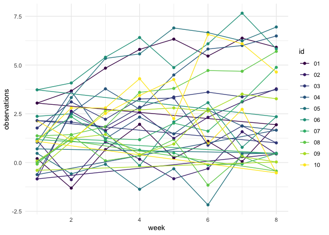
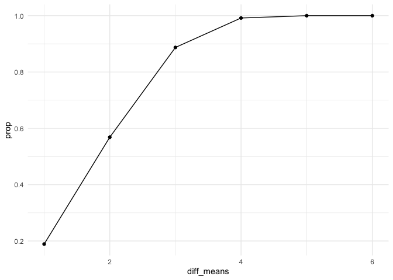

p8105\_hw5\_ll3344
================
Lusha Liang

## Problem 1

Load necessary
    packages.

``` r
library(tidyverse)
```

    ## ── Attaching packages ──────────────────────────────────────────────────────────────────────────────────────── tidyverse 1.3.0 ──

    ## ✓ ggplot2 3.3.2     ✓ purrr   0.3.4
    ## ✓ tibble  3.0.1     ✓ dplyr   1.0.2
    ## ✓ tidyr   1.1.0     ✓ stringr 1.4.0
    ## ✓ readr   1.3.1     ✓ forcats 0.5.0

    ## ── Conflicts ─────────────────────────────────────────────────────────────────────────────────────────── tidyverse_conflicts() ──
    ## x dplyr::filter() masks stats::filter()
    ## x dplyr::lag()    masks stats::lag()

``` r
library(viridis)
```

    ## Loading required package: viridisLite

``` r
library(plotly)
```

    ## 
    ## Attaching package: 'plotly'

    ## The following object is masked from 'package:ggplot2':
    ## 
    ##     last_plot

    ## The following object is masked from 'package:stats':
    ## 
    ##     filter

    ## The following object is masked from 'package:graphics':
    ## 
    ##     layout

``` r
library(patchwork)
```

``` r
# Minimalist theme
theme_set(theme_minimal())
```

Read in the data.

``` r
homicide_df = 
  read_csv("./data/homicide_data.csv") %>%
  mutate(
    city_state = str_c(city, state, sep = "_"),
    resolved = case_when(
      disposition == "Closed without arrest" ~ "unsolved",
      disposition == "Open/No arrest"        ~ "unsolved",
      disposition == "Closed by arrest"      ~ "solved"
    )
  ) %>%
  select(city_state, resolved) %>%
  filter(city_state != "Tulsa_AL")
```

    ## Parsed with column specification:
    ## cols(
    ##   uid = col_character(),
    ##   reported_date = col_double(),
    ##   victim_last = col_character(),
    ##   victim_first = col_character(),
    ##   victim_race = col_character(),
    ##   victim_age = col_character(),
    ##   victim_sex = col_character(),
    ##   city = col_character(),
    ##   state = col_character(),
    ##   lat = col_double(),
    ##   lon = col_double(),
    ##   disposition = col_character()
    ## )

Group by city\_state variable and count total and unsolved homicides.

``` r
aggregate_df = 
  homicide_df %>%
  group_by(city_state) %>%
  summarize(
    hom_total = n(),
    hom_unsolved = sum(resolved == "unsolved")
  ) 
```

    ## `summarise()` ungrouping output (override with `.groups` argument)

Do a prop test for a single city.

``` r
prop.test(
  aggregate_df %>% filter(city_state == "Baltimore_MD") %>% pull(hom_unsolved),
  aggregate_df %>% filter(city_state == "Baltimore_MD") %>% pull(hom_total)) %>% 
  broom::tidy()
```

    ## # A tibble: 1 x 8
    ##   estimate statistic  p.value parameter conf.low conf.high method    alternative
    ##      <dbl>     <dbl>    <dbl>     <int>    <dbl>     <dbl> <chr>     <chr>      
    ## 1    0.646      239. 6.46e-54         1    0.628     0.663 1-sample… two.sided

Iterate for multiple cities at once.

``` r
results_df = 
  aggregate_df %>%
  mutate(
    prop_tests = map2(.x = hom_unsolved, .y = hom_total, ~prop.test(x = .x, n = .y)),
    tidy_tests = map(.x = prop_tests, ~broom::tidy(.x))
  ) %>%
  select(-prop_tests) %>%
  unnest(tidy_tests) %>%
  select(city_state, estimate, conf.low, conf.high)
```

``` r
results_df %>%
  mutate(city_state = fct_reorder(city_state, estimate)) %>%
  ggplot(aes(x = city_state, y = estimate)) +
  geom_point() + 
  geom_errorbar(aes(ymin = conf.low, ymax = conf.high)) +
  theme(axis.text.x = element_text(angle = 90, vjust = 0.5, hjust = 1)) 
```

<!-- -->

## Problem 2

Load and tidy the data.

``` r
lga_df = 
  tibble(
    path = list.files("prob_2"),
  ) %>% 
  mutate(
    path = str_c("prob_2/", path),
    data = map(path, read_csv)
    ) %>%
  unnest(data) %>%
  mutate(path = str_replace(path, "prob_2/", " "),
         path = str_replace(path, ".csv", " ")) %>%
  separate(path, into = c("group", "id"), sep = "_") %>%
  pivot_longer(
    week_1:week_8,
    names_to = "week", 
    names_prefix = "week_", 
    values_to = "observations"
  ) %>%
  mutate(
    group = str_replace(group, "con", "control"),
    group = str_replace(group, "exp", "experimental")
  ) %>%
  relocate(id) %>%
  mutate(
    group = as.factor(group),
    week = as.numeric(week)
  )
```

    ## Parsed with column specification:
    ## cols(
    ##   week_1 = col_double(),
    ##   week_2 = col_double(),
    ##   week_3 = col_double(),
    ##   week_4 = col_double(),
    ##   week_5 = col_double(),
    ##   week_6 = col_double(),
    ##   week_7 = col_double(),
    ##   week_8 = col_double()
    ## )
    ## Parsed with column specification:
    ## cols(
    ##   week_1 = col_double(),
    ##   week_2 = col_double(),
    ##   week_3 = col_double(),
    ##   week_4 = col_double(),
    ##   week_5 = col_double(),
    ##   week_6 = col_double(),
    ##   week_7 = col_double(),
    ##   week_8 = col_double()
    ## )
    ## Parsed with column specification:
    ## cols(
    ##   week_1 = col_double(),
    ##   week_2 = col_double(),
    ##   week_3 = col_double(),
    ##   week_4 = col_double(),
    ##   week_5 = col_double(),
    ##   week_6 = col_double(),
    ##   week_7 = col_double(),
    ##   week_8 = col_double()
    ## )
    ## Parsed with column specification:
    ## cols(
    ##   week_1 = col_double(),
    ##   week_2 = col_double(),
    ##   week_3 = col_double(),
    ##   week_4 = col_double(),
    ##   week_5 = col_double(),
    ##   week_6 = col_double(),
    ##   week_7 = col_double(),
    ##   week_8 = col_double()
    ## )
    ## Parsed with column specification:
    ## cols(
    ##   week_1 = col_double(),
    ##   week_2 = col_double(),
    ##   week_3 = col_double(),
    ##   week_4 = col_double(),
    ##   week_5 = col_double(),
    ##   week_6 = col_double(),
    ##   week_7 = col_double(),
    ##   week_8 = col_double()
    ## )
    ## Parsed with column specification:
    ## cols(
    ##   week_1 = col_double(),
    ##   week_2 = col_double(),
    ##   week_3 = col_double(),
    ##   week_4 = col_double(),
    ##   week_5 = col_double(),
    ##   week_6 = col_double(),
    ##   week_7 = col_double(),
    ##   week_8 = col_double()
    ## )
    ## Parsed with column specification:
    ## cols(
    ##   week_1 = col_double(),
    ##   week_2 = col_double(),
    ##   week_3 = col_double(),
    ##   week_4 = col_double(),
    ##   week_5 = col_double(),
    ##   week_6 = col_double(),
    ##   week_7 = col_double(),
    ##   week_8 = col_double()
    ## )
    ## Parsed with column specification:
    ## cols(
    ##   week_1 = col_double(),
    ##   week_2 = col_double(),
    ##   week_3 = col_double(),
    ##   week_4 = col_double(),
    ##   week_5 = col_double(),
    ##   week_6 = col_double(),
    ##   week_7 = col_double(),
    ##   week_8 = col_double()
    ## )
    ## Parsed with column specification:
    ## cols(
    ##   week_1 = col_double(),
    ##   week_2 = col_double(),
    ##   week_3 = col_double(),
    ##   week_4 = col_double(),
    ##   week_5 = col_double(),
    ##   week_6 = col_double(),
    ##   week_7 = col_double(),
    ##   week_8 = col_double()
    ## )
    ## Parsed with column specification:
    ## cols(
    ##   week_1 = col_double(),
    ##   week_2 = col_double(),
    ##   week_3 = col_double(),
    ##   week_4 = col_double(),
    ##   week_5 = col_double(),
    ##   week_6 = col_double(),
    ##   week_7 = col_double(),
    ##   week_8 = col_double()
    ## )
    ## Parsed with column specification:
    ## cols(
    ##   week_1 = col_double(),
    ##   week_2 = col_double(),
    ##   week_3 = col_double(),
    ##   week_4 = col_double(),
    ##   week_5 = col_double(),
    ##   week_6 = col_double(),
    ##   week_7 = col_double(),
    ##   week_8 = col_double()
    ## )
    ## Parsed with column specification:
    ## cols(
    ##   week_1 = col_double(),
    ##   week_2 = col_double(),
    ##   week_3 = col_double(),
    ##   week_4 = col_double(),
    ##   week_5 = col_double(),
    ##   week_6 = col_double(),
    ##   week_7 = col_double(),
    ##   week_8 = col_double()
    ## )
    ## Parsed with column specification:
    ## cols(
    ##   week_1 = col_double(),
    ##   week_2 = col_double(),
    ##   week_3 = col_double(),
    ##   week_4 = col_double(),
    ##   week_5 = col_double(),
    ##   week_6 = col_double(),
    ##   week_7 = col_double(),
    ##   week_8 = col_double()
    ## )
    ## Parsed with column specification:
    ## cols(
    ##   week_1 = col_double(),
    ##   week_2 = col_double(),
    ##   week_3 = col_double(),
    ##   week_4 = col_double(),
    ##   week_5 = col_double(),
    ##   week_6 = col_double(),
    ##   week_7 = col_double(),
    ##   week_8 = col_double()
    ## )
    ## Parsed with column specification:
    ## cols(
    ##   week_1 = col_double(),
    ##   week_2 = col_double(),
    ##   week_3 = col_double(),
    ##   week_4 = col_double(),
    ##   week_5 = col_double(),
    ##   week_6 = col_double(),
    ##   week_7 = col_double(),
    ##   week_8 = col_double()
    ## )
    ## Parsed with column specification:
    ## cols(
    ##   week_1 = col_double(),
    ##   week_2 = col_double(),
    ##   week_3 = col_double(),
    ##   week_4 = col_double(),
    ##   week_5 = col_double(),
    ##   week_6 = col_double(),
    ##   week_7 = col_double(),
    ##   week_8 = col_double()
    ## )
    ## Parsed with column specification:
    ## cols(
    ##   week_1 = col_double(),
    ##   week_2 = col_double(),
    ##   week_3 = col_double(),
    ##   week_4 = col_double(),
    ##   week_5 = col_double(),
    ##   week_6 = col_double(),
    ##   week_7 = col_double(),
    ##   week_8 = col_double()
    ## )
    ## Parsed with column specification:
    ## cols(
    ##   week_1 = col_double(),
    ##   week_2 = col_double(),
    ##   week_3 = col_double(),
    ##   week_4 = col_double(),
    ##   week_5 = col_double(),
    ##   week_6 = col_double(),
    ##   week_7 = col_double(),
    ##   week_8 = col_double()
    ## )
    ## Parsed with column specification:
    ## cols(
    ##   week_1 = col_double(),
    ##   week_2 = col_double(),
    ##   week_3 = col_double(),
    ##   week_4 = col_double(),
    ##   week_5 = col_double(),
    ##   week_6 = col_double(),
    ##   week_7 = col_double(),
    ##   week_8 = col_double()
    ## )
    ## Parsed with column specification:
    ## cols(
    ##   week_1 = col_double(),
    ##   week_2 = col_double(),
    ##   week_3 = col_double(),
    ##   week_4 = col_double(),
    ##   week_5 = col_double(),
    ##   week_6 = col_double(),
    ##   week_7 = col_double(),
    ##   week_8 = col_double()
    ## )

Create a spaghetti plot showing observations on each subject over time.

``` r
lga_df %>%
  group_by(id) %>%
  ggplot(aes(x = week, y = observations, color = id, group = id)) +
  geom_point() +
  geom_path() +
  scale_colour_viridis_d()
```

<!-- -->

``` r
lga_df %>%
  mutate(text_label = str_c("Study ID: ", id, "\nGroup:", group)) %>%
  plot_ly(
    x = ~week, y = ~observations, color = ~id,
    colors = "viridis", type = "scatter",
    mode = "line", text = ~text_label
  )
```

    ## Warning: `arrange_()` is deprecated as of dplyr 0.7.0.
    ## Please use `arrange()` instead.
    ## See vignette('programming') for more help
    ## This warning is displayed once every 8 hours.
    ## Call `lifecycle::last_warnings()` to see where this warning was generated.

<!-- -->

In general, the experimental arm has higher values for the observations.

## Problem 3

``` r
set.seed(1)

sim_mean_p = function(n = 30, mean, sd = 5) {
  
  sim_data = tibble(
    x = rnorm(n = n, mean, sd = sd),
  ) %>%
    t.test() %>%
    broom::tidy() %>%
    select(estimate, p.value) %>%
    rename(sample_mean = estimate)
}

sim_results = 
  rerun(5000, sim_mean_p(mean = 0)) %>%
  bind_rows()
```

``` r
mean_list = 
  list(
    "mean_1" = 1,
    "mean_2" = 2,
    "mean_3" = 3,
    "mean_4" = 4,
    "mean_5" = 5,
    "mean_6" = 6
  )

sim_vary_means = 
  tibble(diff_means = c(1, 2, 3, 4, 5, 6)) %>%
  mutate(
    output_lists = map(.x = diff_means, ~rerun(5000, sim_mean_p(mean = .x))),
    estimate_dfs = map(output_lists, bind_rows)) %>%
      select(-output_lists) %>%
      unnest(estimate_dfs)
```

``` r
sim_vary_means %>%
  filter(p.value < 0.05) %>%
  group_by(diff_means) %>%
  count() %>%
  mutate(prop = n/5000) %>%
  ggplot(aes(x = diff_means, y = prop)) +
  geom_line() +
  geom_point()
```

<!-- -->

``` r
all_means_p = 
  sim_vary_means %>%
  mutate(
    diff_means = str_c("mean = ", diff_means)
  ) %>%
  ggplot(aes(x = diff_means, y = sample_mean, fill = diff_means)) +
  geom_violin(alpha = .5) +
  xlab("True Means") + 
  ylab("Sample Means") +
  theme(legend.position = "none") + 
  ggtitle("All Means") +
  theme(plot.title = element_text(hjust = 0.5))

rejected_means_p =
  sim_vary_means %>%
  mutate(
    diff_means = str_c("mean = ", diff_means)
  ) %>%
  filter(p.value < 0.05) %>%
  ggplot(aes(x = diff_means, y = sample_mean, fill = diff_means)) +
  geom_violin(alpha = .5) + 
  xlab("True Means") + 
  ylab("Sample Means") +
  theme(legend.position = "none") + 
  ggtitle("Rejected Means") +
  theme(plot.title = element_text(hjust = 0.5))

all_means_p + rejected_means_p
```

<!-- -->
